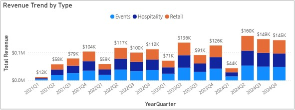
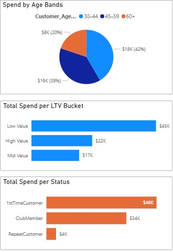
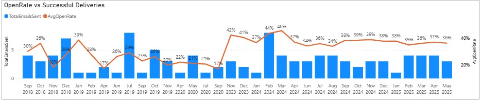
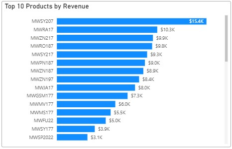

# SMB_2_Anonymized: End-to-End Data Warehouse for a FoodBev and Hospitality Business

Project Type: End-to-End Data Warehouse + Power BI Reporting
Business Domain: Food, Beverage and Hospitality Business (Anonymized)
Tools Used: SQL Server, dbt (conceptually), Power BI, T-SQL, Power Query

This repository showcases a fully anonymized SQL Server-based data warehouse project designed for a small, consumer-facing business. The solution includes structured ETL layers (Bronze → Silver → Gold), performance-optimized views, and an integrated Power BI report — all built to support robust insights across sales, revenue trends, customer behavior, marketing and product metrics.

> ⚠️ All customer, product, and financial data has been anonymized for public sharing. No real customer names, emails, product identifiers, or original business names remain.

---

## 📁 Project Structure

```
📂 SMB_2_Anonymized/
├── 📜 Scripts
|   ├── 📜 ddl_bronze.sql
|   ├── 📜 load_bronze_data.sql
|   ├── 📜 ddl_silver.sql (business data, dimensions, special calendars)
|   ├── 📜 load_silver_data.sql
|   ├── 📜 silver.quality_checks
|   └── 📜 create_gold_views.sql
├── 📸 screenshots - report_snapshots/
│   ├── revenue_trend.png
│   ├── customer_segmentation.png
│   ├── email_performance.png
│   └── product_summary.png
├── 📂 Reports
│   ├── smb_bi_etl_pipeline.pbix
├── 📂 Diagrams
│   ├── data_flow_diagram.png
│   └── data_integration_diagram.png  
└── README.md
```

---

## Features

**Layered Data Architecture**  
The solution uses a multi-layer warehouse architecture inspired by the medallion approach:
 - Bronze Layer – Raw structured data from CSVs and external systems
 - Silver Layer – Cleaned, enriched, and normalized dimension and fact tables
 - Gold Layer – Reporting views and final aggregates used in Power BI

No raw data or CSVs are included in this repository to preserve privacy.

**Anonymization Logic**  
 - Replaced all customer names and emails with randomized placeholders.
 - Removed or masked any references to identifiable product names or business locations.
 - Replaced product names with SKU-only representations.
 - Randomized revenue amounts, order quantities, customer locations and marketing engagement metrics within realistic ranges.
 - Masked any references to revenue types and removed email subject and email titles.
 - All scripts referencing proprietary or client-specific terms have been excluded for confidentiality.

**Power BI Integration (Not Included)**  
  The report is organized into the following pages:

  1. Revenue Detail – Monthly and quarterly trends by revenue types and sales channels, includes YoY change in tooltips, special revenue events and lifetime sales summaries.
  2. Customer Insight – Demographic breakdown of sales, customer revenue by LTV status, tenure bands and loyalty status, top customers, retention flags
  3. Customer Map – Top customer cities by order volume
  4. Social Media – Facebook and Instagram engagement metrics over time (interactions, reach, visits, follows, CTR)
  5. Email Marketing – Campaign performance (successful deliveries, open rate, click rate, bounce rate, CTOR), audience trends, top email campaigns
  6. Product Metrics – SKU performance (total sales, avg sales price), inventory status (stale vs active), top product

Screenshots of report pages are provided in the /screenshots folder.

---
**Highlights & Features**
- Custom Data Modeling – Surrogate keys, fact/dim separation, CTEs for transformations, revenue, customer and product segmentation
- Anonymization Layer – Dynamic replacements for names, emails, and transaction values
- Advanced Metrics – YoY % changes, tenure calculations, engagement ratios (CTR, CTOR, Bounce Rate)
- Data Quality Rules – Junk email filters, zip code validators, data completeness flags
- Load Procedure Design – Robust stored procedure for layer-to-layer ETL with batch execution tracking (start/end timestamps and duration logging)

**What’s Not Included (by design)**
- Source CSVs or financial data
- Anonymization scripts (may reveal original entity)
- Fully runnable CREATE DATABASE scripts
  
For security reasons, these components are omitted but can be discussed privately upon request.

**Purpose of This Repo**
This project serves as a portfolio demonstration of the following capabilities:

- SQL-based warehouse design and transformation
- Business KPI modeling for a small business
- Power BI dashboard design and storytelling
- Data anonymization strategy for client confidentiality

**Questions or Collaboration?**
If you'd like to discuss this project, request a deeper walkthrough, or talk about how this process can be applied to your organization, feel free to reach out via LinkedIn or open an issue in this repo.

---

## Sample Visualizations

> Below are select Power BI report snapshots created using the anonymized dataset.

| Revenue Trend (YoY%) | Customer Segments |
|----------------------|-------------------|
|  |  |

| Email Engagement | Product Revenue Summary |
|------------------|-------------------------|
|  |  |

---

If you'd like a walkthrough of the full Power BI report or have questions about the modeling decisions, feel free to reach out or open an issue.

---

## 🧠 Author

**Daniel Cheruiyot**  
Data & Business Insights Analyst | BI Developer  
📧 [LinkedIn](https://www.linkedin.com/in/cheruiyotdaniel)  
